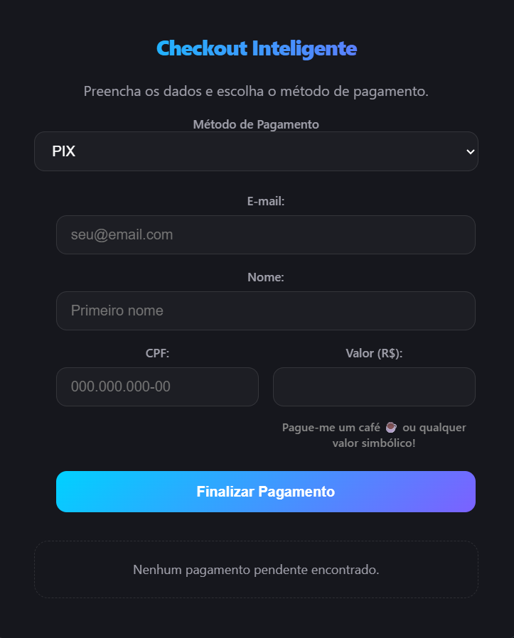

<p align="center">
  
  
  
  
  
</p>

# MVP Pagamentos Mercado Pago (Vite + Serverless Node)

> MVP completo para integração de pagamentos PIX e Boleto via Mercado Pago, pronto para produção na Vercel, com frontend React moderno e backend serverless.

---




<p align="center">
  <a href="https://mvp-mercado-pago.vercel.app/" target="_blank" style="text-decoration:none;">
    
  </a>
</p>

## 🚀 Funcionalidades
- Checkout PIX e Boleto
- Valor customizado
- Máscara de CPF
- Polling automático de status
- Lista de vendas pendentes (todas da conta Mercado Pago)
- Cancelamento de pagamentos pendentes
- Backend seguro (Node.js serverless)
- Pronto para deploy na Vercel
- UX aprimorada: botão voltar, contraste acessível, feedbacks visuais

## 🗂️ Estrutura do Projeto
```
MVP-pagamentos-mercadoPago/
  api/                 # Backend serverless (Vercel Functions)
    payments.js        # Criação de pagamentos
    payments/
      pendentes.js     # Lista de pendentes
      [id].js          # Consulta/cancelamento por ID
  src/                 # Frontend React/Vite
    components/
    hooks/
    domain/
    infra/
  .gitignore
  README.md
  package.json
  ...
```

## ⚙️ Instalação e Deploy

1. **Clone o repositório:**
   ```bash
   git clone https://github.com/seu-usuario/MVP-pagamentos-mercadoPago.git
   cd MVP-pagamentos-mercadoPago
   ```

2. **Configure as variáveis de ambiente:**
   - No painel da Vercel, adicione `MP_TOKEN` com seu Access Token do Mercado Pago.

3. **Deploy na Vercel:**
   - O frontend (src/) será detectado automaticamente.
   - O backend (api/) será usado como API Functions.
   - Não é necessário arquivo `vercel.json`. O roteamento é automático.

## 📝 Como Funciona
- O frontend faz requisições para `/api/payments` (criação), `/api/payments/pendentes` (listar pendentes), `/api/payments/:id` (consulta/cancelamento).
- O backend recebe, processa e repassa para a API do Mercado Pago.
- O token nunca é exposto no frontend.
- Polling automático monitora o status do pagamento.
- UX aprimorada: botão voltar, feedback visual, contraste acessível.

## 💻 Endpoints Backend
- `POST /api/payments` — Cria pagamento (PIX ou Boleto)
- `GET /api/payments/pendentes` — Lista pagamentos pendentes da conta
- `GET /api/payments/:id` — Consulta status de pagamento
- `PUT /api/payments/:id` — Cancela pagamento

## 🛠️ Desenvolvimento Local
- Rode o frontend: `cd src && npm install && npm run dev`
- Para testar funções serverless localmente, use o Vercel CLI ou rode apenas o frontend em modo dev (as funções são chamadas via API na Vercel em produção).

## 🔒 Segurança
- O token do Mercado Pago fica apenas no backend (api/).
- O arquivo `.env` está no `.gitignore`.

---
Desenvolvido por Shepardy para a comunidade de desenvolvedores.
